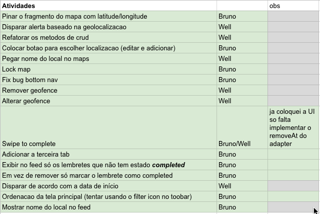

# Relatório

## Divisão do trabalho:
Escolhemos organizar o desenvolvimento do aplicativo de uma forma que pudéssemos trabalhar de forma independente na codificação. Por isso dividimos atividades nas categorias **backend** e o **frontend** do aplicativo, sendo:
- **Backend**: Implementação do banco de dados utilizando **room** e implementação do gerenciamento de geofences, etc.
- **Frontend**: Implementação do formulário de cadastro dos lembretes com validação dos campos, inserção de imagem nos lembretes, etc.

Dividimos as tarefas em uma planilha para facilitar a comunicação entre os integrantes:

## Implementação
Criamos a interface ReminderManager que serviou para separar os que diz respeito a manipulação dos lembretes da interface com o usuário. Dessa forma a codificação do frontend poderia ser feita obedecendo apenas aos métodos definidos no ReminderManager.
