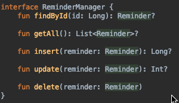
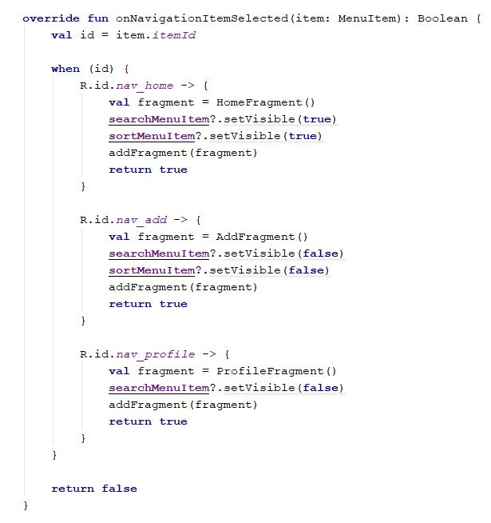
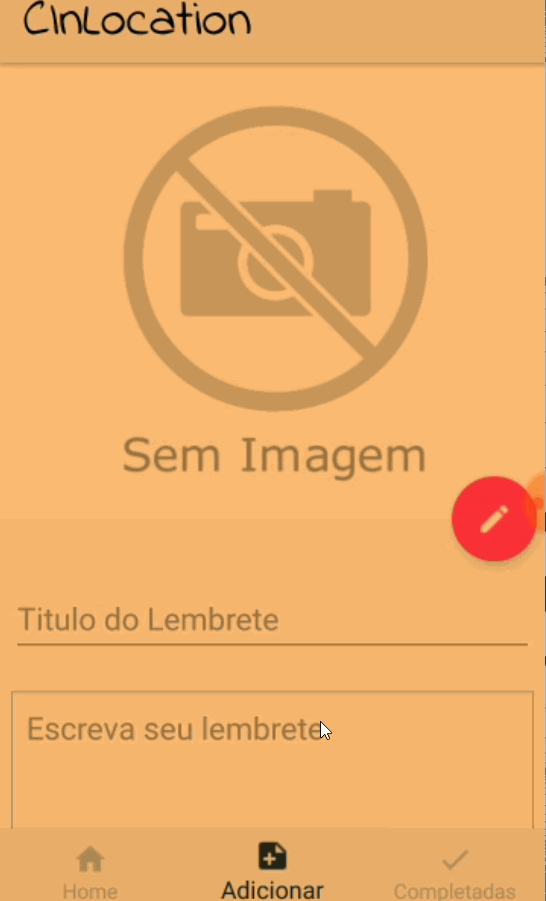
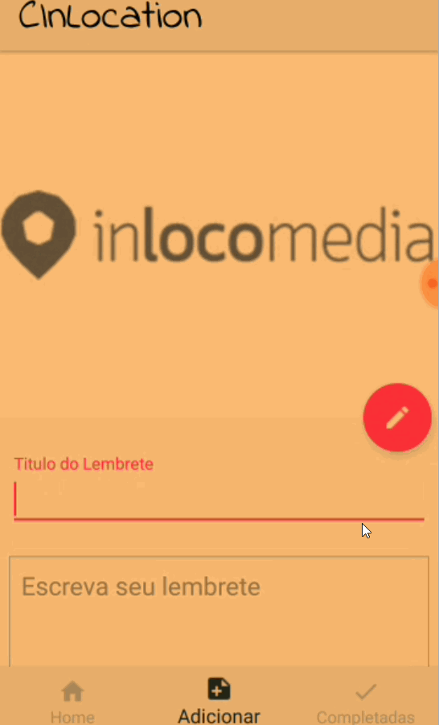
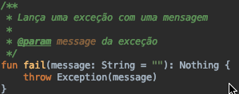

# Relatório

## Divisão do trabalho:
Escolhemos organizar o desenvolvimento do aplicativo de uma forma que pudéssemos trabalhar de forma independente na codificação. Por isso dividimos atividades nas categorias backend e o frontend do aplicativo, sendo:
- Backend: Implementação do banco de dados utilizando room e implementação do gerenciamento de geofences, etc.
- Frontend: Implementação do formulário de cadastro dos lembretes com validação dos campos, inserção de imagem nos lembretes, etc.
Dividimos as tarefas em uma planilha para facilitar a comunicação entre os integrantes:

Dividimos as tarefas em uma planilha para facilitar a comunicação entre os integrantes:

## Implementação
### Backend

Criamos a interface ReminderManager que serviu para separar o que diz respeito a manipulação dos lembretes da interface com o usuário. Dessa forma a codificação do frontend poderia ser feita obedecendo apenas aos métodos definidos no ReminderManager.

 
Interface ReminderManager

Seguindo o padrão de utilização da recomendado na pela biblioteca room implementamos um DAO (Data Access Object) cuja implementação é gerada pela biblioteca. Dessa forma o ReminderManagerImp era responsável por chamar os métodos do DAO e também por gerenciar o registro das geofences.

## Implementação
### Front-end

Utilizando o Material Design do Android, alguns bons padrões de UX/UI foram aplicados ao CInLocation.

1. Resolvemos utilizar fragmentos combinados ao Bottom Navigation para um maior poder de reaproveitamento do código, utilizando a metodologia DRY (don't repeat yourself), e também uma boa organização da interface do usuário.

2. Outro bom padrão utilizado foi o Collapse Toolbar Layout, que é uma das coisas mais incríveis da biblioteca de suporte de design do android e facilita muito a compreensão da screen como um todo para o usuário.

 3.	Também adotamos a opção de swipe para marcar um reminder como completo, deixando a tela de home bem mais intuitiva e melhorando a experiência do usuário.
 

## Boas práticas

Comentários foram utilizados seguindo a recomendação do [padrão de documentação em Kotlin](https://kotlinlang.org/docs/reference/kotlin-doc.html):

Também tiramos proveito da modularidade que Kotlin oferece criando o arquivo Utils.kt em que é possível exportar diversas funções utilizadas por todo o código da aplicação evitando aumentando o reuso de código, como a função fail abaixo:

