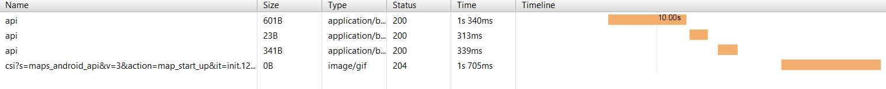
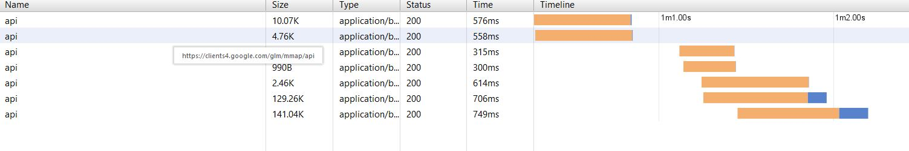

# Consumo da Rede

Nossa aplicação se comunica com a rede apenas quando se dá o uso do Google Maps. Esse uso da rede se divide da seguinte maneira:

1. O carregamento da tela de Adicionar Reminder, contém uma comunicação para setar um local estático no lembrete. Essa comunicação tem um custo de **965 Bytes**, como mostra a imagem a seguir: 

2. Quando o usuário clica no mapa para escolher um local ele é redirecionado para a aplicação de Maps do Google que vem instalada nativamente em todos os aparelhos. A partir de então, o consumo da rede já não é mais feita por nosso app, até o momento em que chega o retorno do lugar escolhido pelo usuário e precisamos setar uma nova localização. Esse pacote de retorno tem um custo bastante ínfimo, contento apenas a lat/long escolhida pelo usuário, já o envio de dados tem um custo um pouco maior (aproximadamente **280K**), como mostra a imagem abaixo:

