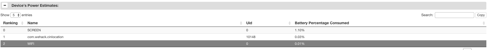

# Bateria

Para coletar dados de consumo da bateria utilizamos o [Battery Historian](https://github.com/google/battery-historian) que produz reports bastante completos e complexos. Entretanto, para o propósito da cadeira exibiremos aqui apenas a utilização de bateria do aplicativo:

- Para realizar esse teste utilizamos a aplicação com o dispositivo desconectado de qualquer fonte de energia por aproximadamente 10 minutos. Durante esse tempo realizamos atividades do app como cadastrar, remover e disparar lembretes. O dispositivo também passou alguns minutos inativo com dois lembretes cadastrados que não haviam sido disparados ainda, ou seja, o aplicativo estava utilizando a localização no background.