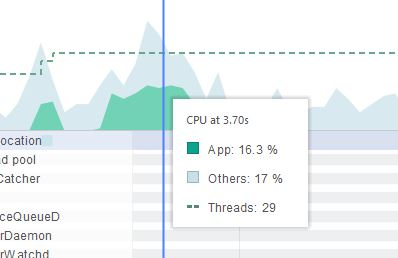
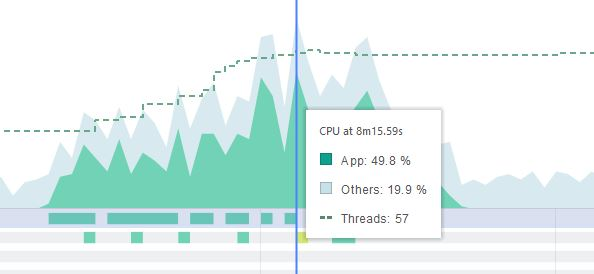
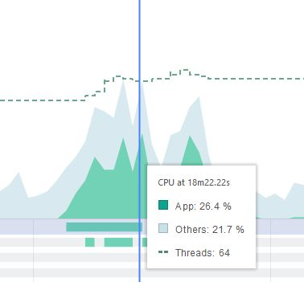
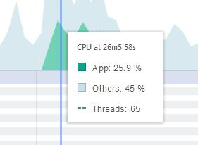
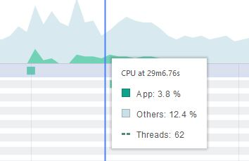
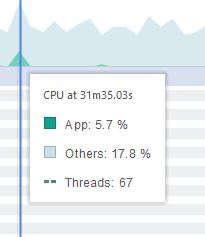

# CPU

Antes de falar dos testes de CPU vale lembrar que eles foram feitos no celular Xiaomi Mi A1, quad-core e 4GB de memória RAM. Todas as porcetagens mostradas abaixos serão relativas a este aparelho.

1. Ao abrir o app, é consumido quase **16%** de CPU, como mostra a imagem abaixo. Acreditamos que isso é uma excelente medida, pelo fato de trabalharmos bastante com imagens na screen principal principal.

2. Ir para o fragmento de cadastro faz o uso de CPU subir até um limiar de **50%**, algo bem elevado levando em consideração as capacidades do celular. Os outros apps neste momento, somavam um uso de CPU no total de 20%. A medição desta tela bate com o fato relatado na análise de memória de que tanto a tela de cadastro como a de edição são as mais pesadas do nosso app devido ao número de efeitos visuais. Porém é importante resaltar que o CInLocation não apresentou nenhum tipo de travamento ainda que com o uso de CPU elevado. Voltar pra esse Fragment novamente, diminui o uso do CPU em 10%.

3. A tela de edição, ainda que semelhante a de cadastro, tem menos componentes do que a mesma porque é uma activity separada e seu uso de CPU nos nossos testes oscilou em torno de 30%.

4. O Fragment de lembretes completados é semelhante ao da Home, apenas com a opçao de deletar o lembrete a mais. A variação de consumo do CPU entre as duas nos nossos testes foi bem ínfima.

Outras ações também foram testadas para se tentar extrair um padrão de comportamento:
- Resposta do mapa ao mudar de localização

- Usar o swap da tela principal para marcar como completo

- Deletar um lembrete

