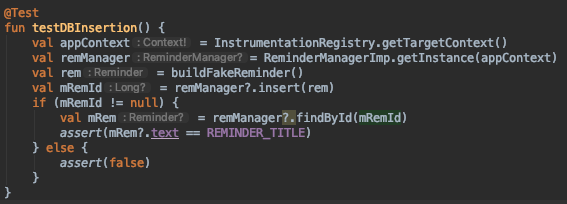
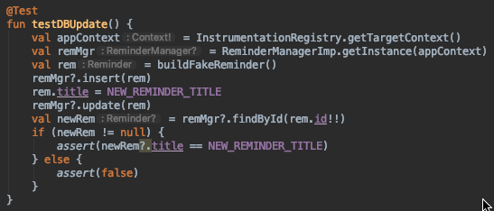
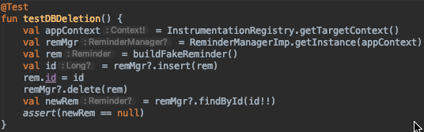

# Testes

Como adicional, alguns testes foram escritos para assegurar que o cadastro dos lembretes no banco estavam funcionando da forma adequada:

- Teste de inserção: Insere um lembrete no banco e depois checa que existe um lembrete com mesmo título no banco de dados (seguro pois o banco estará vazio).

- Teste de atualização: Insere um lembrete no banco e depois altera seu título e checa se existe um lembrete no banco com o novo título.

- Teste de remoção: Insere um lembrete no bancoe guarda o id, remove e checa se nenhuma entidade é retornada quando consultado pelo id.
